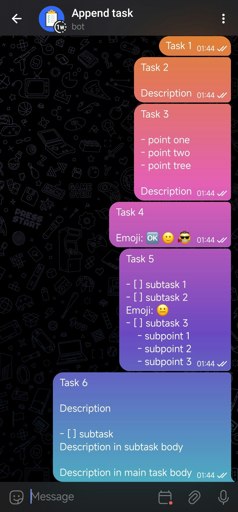
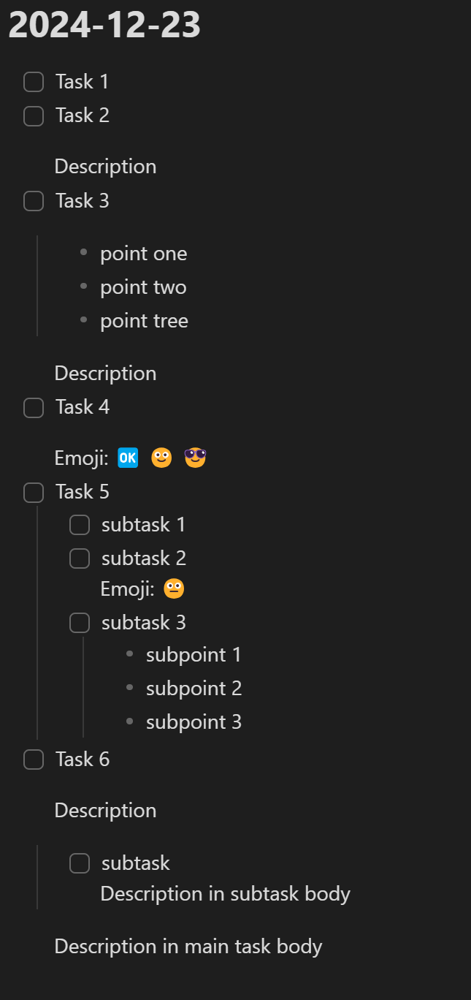

<p align="center">
  <a href="README.ru.md"></a>&nbsp;&nbsp;
  <a href="README.md"></a>&nbsp;&nbsp;
  &nbsp;&nbsp;
  
</p>

# tasks-from-telegram-bot-to-markdown

A program that checks the latest messages from a Telegram user and records tasks in markdown format.

<div style="text-align: center;">
  
  <p>Dialog with bot</p>
</div>

<div style="display: flex; justify-content: space-between; align-items: center;">
  <div style="text-align: center;">
    
    <p>USE_COLLOUT_FORMAT = True</p>
  </div>

  <div style="text-align: center;">
    
    <p>USE_COLLOUT_FORMAT = False</p>
  </div>
</div>

## Installation

To set up the program, follow these steps:

### Configuration (in config.py)

1. **Set the `USE_COLLOUT_FORMAT` to `True` if you want to use the callout format (Obsidian format) for tasks in the markdown file. Set it to `False` to use the standard markdown task format.**

   ```python
   USE_COLLOUT_FORMAT = True  # Use callout format or not
   ```

2. **Replace `YOU_USER_ID` with your unique Telegram user ID. This is a 10-character number.**

   - To find your Telegram user ID, you can use the following steps:
     1. Open Telegram and search for the [userinfobot](https://t.me/userinfobot).
     2. Start a chat with the bot, and it will send you a message with your unique Telegram user ID.

   ```python
   USER_ID = YOU_USER_ID
   ```

3. **Replace `YOU_BOT_TOKEN` with the authentication token you received from BotFather.**

   - To create a bot and get the token:
     1. Open Telegram and search for the [BotFather](https://t.me/BotFather).
     2. Start a chat with BotFather and send the command `/newbot`.
     3. Follow the instructions to give your bot a name and a username.
     4. After the bot is created, BotFather will send you a message with your bot’s authentication token. The token looks like this: `123456789:ABCDEFghijklmnOpQRstUvWXyz123456`

   ```python
   BOT_TOKEN = "YOU_BOT_TOKEN"
   ```

4. **Set `DAILY_FOLDER_PATH` to the path where you want the markdown files to be saved.**

   ```python
   DAILY_FOLDER_PATH = "YOU_PATH_TO_DAILY_NOTES_FOLDER"
   ```

### Automatic Execution

On Windows (using Task Scheduler):

1. Open the **Task Scheduler** by searching for it in the Start menu.
2. Click on **Create task** in the right-hand panel.
3. Give your task a name (e.g., "Telegram Bot Task").
4. Go to the **Triggers** tab, and click **New**.
    - Set the **Begin the task** option to **At logon** to make sure the task starts when you log into your system.
    - Check **Repeat task every** and set it to repeat every X minutes (e.g., every 10 minutes).
5. Go to the **Actions** tab, click **New**, and choose **Start a Program**.
6. Browse and select the Python executable (`python.exe`).
7. In the **Add arguments** field, enter the path to your script (e.g., `C:\path\to\your\tasks_from_telegram_bot_to_markdown.py`).
8. Click **OK** to save the task.

<div style="justify-content: space-between; align-items: center;">
  <div style="text-align: center;">
    
  </div>

  <div style="text-align: center;">
    
  </div>

  <div style="text-align: center;">
    
  </div>
</div>
