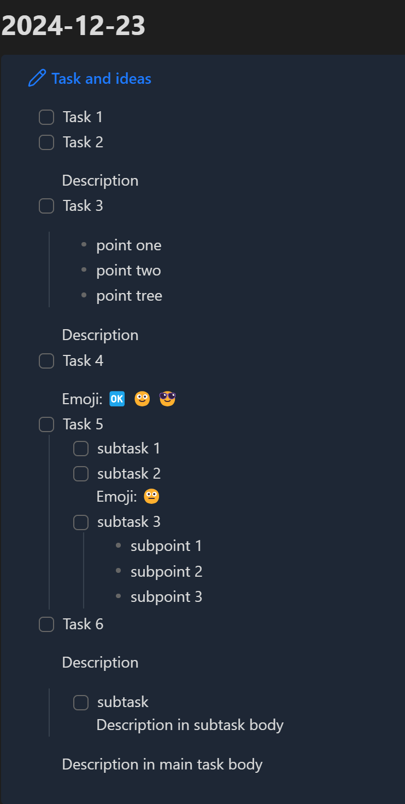

<p align="center">
  <a href="README.ru.md"></a>&nbsp;&nbsp;
  <a href="README.md"></a>&nbsp;&nbsp;
  &nbsp;&nbsp;
  
</p>

# tasks-from-telegram-bot-to-markdown

Программа, которая проверяет последние сообщения от пользователя Telegram и записывает задачи в формате markdown.

<div style="text-align: center;">
  
  <p>Диалог с ботом</p>
</div>

<div style="display: flex; justify-content: space-between; align-items: center;">
  <div style="text-align: center;">
    
    <p>USE_COLLOUT_FORMAT = True</p>
  </div>

  <div style="text-align: center;">
    
    <p>USE_COLLOUT_FORMAT = False</p>
  </div>
</div>

## Установка

Чтобы настроить программу, выполните следующие шаги:

### Конфигурация (в файле config.py)

1. **Установите `USE_COLLOUT_FORMAT` в `True`, если хотите использовать формат с выносками (поддерживается Obsidian) для задач в файле markdown. Установите в `False`, если хотите использовать стандартный формат задач markdown.**

   ```python
   USE_COLLOUT_FORMAT = True  # Использовать формат с выносками или нет
   ```

2. **Замените `YOU_USER_ID` на ваш уникальный Telegram ID. Это 10-значный номер.**

   - Чтобы найти ваш Telegram ID, выполните следующие шаги:
     1. Откройте Telegram и найдите [userinfobot](https://t.me/userinfobot).
     2. Начните чат с ботом, и он отправит вам сообщение с вашим уникальным Telegram ID.

   ```python
   USER_ID = YOU_USER_ID
   ```

3. **Замените `YOU_BOT_TOKEN` на токен аутентификации, который вы получили от BotFather.**

   - Чтобы создать бота и получить токен:
     1. Откройте Telegram и найдите [BotFather](https://t.me/BotFather).
     2. Начните чат с BotFather и отправьте команду `/newbot`.
     3. Следуйте инструкциям, чтобы дать вашему боту имя и username.
     4. После создания бота BotFather отправит вам сообщение с токеном аутентификации бота. Токен выглядит так: `123456789:ABCDEFghijklmnOpQRstUvWXyz123456`.

   ```python
   BOT_TOKEN = "YOU_BOT_TOKEN"
   ```

4. **Укажите `DAILY_FOLDER_PATH` как путь к папке, где вы хотите сохранять markdown файлы.**

   ```python
   DAILY_FOLDER_PATH = "YOU_PATH_TO_DAILY_NOTES_FOLDER"
   ```

### Автоматическое выполнение

На Windows (с использованием Планировщика заданий):

1. Откройте **Планировщик заданий**, найдя его в меню Пуск.
2. Нажмите **Создать задачу** в правой панели.
3. Укажите имя задачи (например, "Telegram Bot Task").
4. Перейдите на вкладку **Триггеры** и нажмите **Создать**.
    - Установите параметр **Начать задачу** на **При входе в систему**, чтобы задача запускалась при каждом входе в систему.
    - Установите флажок **Повторять задачу каждые** и задайте интервал (например, каждые 10 минут).
5. Перейдите на вкладку **Действия**, нажмите **Создать**, и выберите **Запуск программы**.
6. Выберите исполнимый файл Python (`python.exe`).
7. В поле **Добавить аргументы** введите путь к вашему скрипту (например, `C:\путь\к\вашему\tasks_from_telegram_bot_to_markdown.py`).
8. Нажмите **ОК**, чтобы сохранить задачу.

<div style="justify-content: space-between; align-items: center;">
  <div style="text-align: center;">
    
  </div>

  <div style="text-align: center;">
    
  </div>

  <div style="text-align: center;">
    
  </div>
</div>
